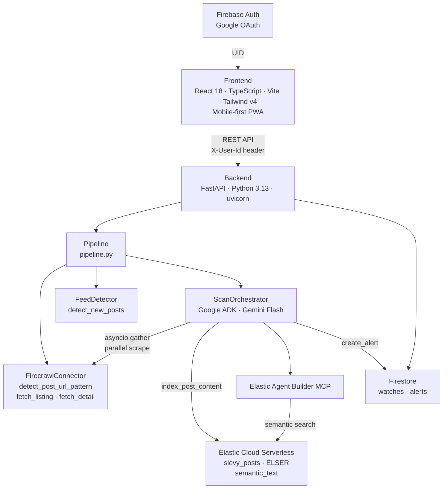

# Sievy

Sievy is a source-bound AI alert filter. You tell it where to watch and what to look for — it reads new posts semantically and alerts you only when something actually matches.

Most people check the same pages every day — rental boards, job listings, local event calendars — and most of what they see is irrelevant. Google Alerts only matches keywords. Visualping only detects visual changes. Neither reads content and judges it against what you actually want.

Sievy does.

## Built for Google Cloud Rapid Agent Hackathon

Sievy was built for the [Google Cloud Rapid Agent Hackathon](https://rapid-agent.devpost.com/) (May–June 2026).

Key Google Cloud integrations:

- **Gemini Flash** via Google ADK — agent orchestration and URL pattern detection
- **Elastic Agent Builder MCP** (Google Cloud partnership) — agent-to-Elasticsearch semantic search via MCP
- **Firebase Auth + Firestore** — user authentication and data persistence

## How It Works

1. **Create a Watch** — paste a listing page URL, pick a category, and describe your criteria in natural language
2. **Pattern detection** — Sievy uses Gemini to identify how individual post URLs are structured on that page, then records the current posts as a baseline
3. **Scan** — on each scan, Sievy fetches new posts since the last baseline, scrapes each one with Firecrawl, and indexes the content in Elasticsearch using ELSER semantic embeddings
4. **Agent judgment** — a Gemini agent uses the Elastic Agent Builder MCP to run a semantic search against the indexed posts, then judges each result against your criteria
5. **Alert** — matching posts appear as alerts with a verdict, extracted fields, and a link to the original post

## Architecture



## Tech Stack

| Layer            | Technology                                        | Purpose                              |
| ---------------- | ------------------------------------------------- | ------------------------------------ |
| Frontend         | React 18, TypeScript, Vite, Tailwind CSS v4       | Mobile-first PWA                     |
| Backend          | Python 3.13, FastAPI, uvicorn, uv                 | REST API server                      |
| Agent            | Google ADK, Gemini Flash                          | Scan orchestration and post judgment |
| Search           | Elastic Cloud Serverless, ELSER (`semantic_text`) | Semantic post indexing and filtering |
| MCP              | Elastic Agent Builder MCP                         | Agent-to-Elasticsearch interface     |
| Scraping         | Firecrawl                                         | Web content extraction               |
| Database         | Cloud Firestore                                   | Watches and alerts persistence       |
| Auth             | Firebase Auth, Google OAuth                       | User authentication                  |
| Package managers | uv (Python), pnpm (Node 24)                       | Dependency management                |

## Supported Sites

Sievy works with any public listing page where individual post links appear in the page's HTML. Below are verified examples.

### Verified

| Site                     | URL                                                     | Category              |
| ------------------------ | ------------------------------------------------------- | --------------------- |
| Devpost                  | https://devpost.com/hackathons                          | Scholarships/Programs |
| MLH                      | https://www.mlh.com/seasons/2026/events                 | Scholarships/Programs |
| MyBallard                | https://www.myballard.com/events/                       | Events                |
| University of Washington | https://www.washington.edu/news/category/news-releases/ | Other                 |
| K-Seattle                | https://kseattle.com/벼룩시장/렌트-하숙                 | Housing               |
| Keimyung University      | https://www.kmu.ac.kr/uni/main/page.jsp?mnu_uid=144     | Scholarships/Programs |
| JYP entertainment        | https://audition.jype.com/audition/auditions            | Audition              |
| Linkareer                | https://linkareer.com/list/activity                     | Jobs/Recruiting       |

### Likely to work

Pages that tend to work well with Sievy:

- **Static or server-rendered listing pages** — the full list of posts is included in the HTML when the page loads. Common on university notice boards, community blogs, and event calendars.
- **Pages with stable post URLs** — each post has a consistent URL with a unique identifier, either as a query parameter (`?uid=123`, `?parm_bod_uid=456`) or as a path slug (`/event/some-title/`).
- **Sites that link out to individual posts** — the listing page contains `<a href>` tags pointing to each post. Sievy reads these links to detect new posts.

### Not supported

| Type                                                       | Why                                                                                                     | Examples                                               |
| ---------------------------------------------------------- | ------------------------------------------------------------------------------------------------------- | ------------------------------------------------------ |
| Login-required pages                                       | Firecrawl cannot authenticate                                                                           | Facebook groups, private boards                        |
| CAPTCHA-heavy sites                                        | Firecrawl gets blocked                                                                                  | Some government portals                                |
| Pages blocked by Firecrawl                                 | Firecrawl explicitly rejects these                                                                      | Craigslist                                             |
| API-driven listing pages                                   | Post links are loaded via a separate Ajax/API call and never appear in the HTML, even after JS renders  | Many React/Next.js SPAs with client-side data fetching |
| Infinite scroll without static links                       | Posts are injected into the DOM on scroll via API calls, not rendered as `<a>` tags in the initial HTML | Some job boards, social feeds                          |
| Sites where posts share the same URL pattern as navigation | Sievy cannot distinguish post links from pagination or category links                                   | Some older CMS sites                                   |

## Local Development

### Prerequisites

- Docker Desktop
- Node.js 20+ and pnpm
- Python 3.13+ and uv
- Firecrawl API key — [firecrawl.dev](https://firecrawl.dev)
- Google Cloud project with Firestore and Firebase Auth enabled
- Elastic Cloud Serverless project — free trial at [cloud.elastic.co](https://cloud.elastic.co)
- Gemini API key — [aistudio.google.com](https://aistudio.google.com)

### 1. Clone and configure

```bash
git clone https://github.com/hyomin-chung/sievy-agent.git
cd sievy-agent
cp .env.example .env
# edit .env with your values
```

### 2. Add service account

Download your Firebase service account JSON and save it at:

```
backend/service-account.json
```

### 3. Start

```bash
docker compose up -d
```

Services started:

- `backend` → http://localhost:8000
- `frontend` → http://localhost:5173
- `elastic` (local, dev only) → http://localhost:9200
- `kibana` (local, dev only) → http://localhost:5601

### 4. First scan

1. Open http://localhost:5173 and sign in with Google
2. Tap **Create Watch**
3. Paste a listing page URL
4. Set a category and describe your criteria
5. Tap **Scan now**

## Environment Variables

| Variable                         | Required | Default                  | Description                                                                        |
| -------------------------------- | -------- | ------------------------ | ---------------------------------------------------------------------------------- |
| `GOOGLE_APPLICATION_CREDENTIALS` | Yes      | `./service-account.json` | Path to Firebase service account                                                   |
| `FIREBASE_PROJECT_ID`            | Yes      | —                        | Firebase project ID                                                                |
| `GOOGLE_API_KEY`                 | Yes      | —                        | Gemini API key                                                                     |
| `GEMINI_MODEL`                   | No       | `gemini-3.5-flash`       | Gemini model name. Default is Flash; can be changed to any available Gemini model. |
| `ELASTIC_CLOUD_URL`              | Yes      | —                        | Elastic Cloud Serverless endpoint                                                  |
| `ELASTIC_API_KEY`                | Yes      | —                        | Elasticsearch API key (read + write)                                               |
| `ELASTIC_MCP_URL`                | Yes      | —                        | Kibana Agent Builder MCP endpoint                                                  |
| `ELASTIC_MCP_API_KEY`            | Yes      | —                        | Kibana API key with Agent Builder privileges                                       |
| `ELASTIC_INDEX_NAME`             | No       | `sievy_posts`            | Elasticsearch index name                                                           |
| `FIRECRAWL_API_KEY`              | Yes      | —                        | Firecrawl API key                                                                  |
| `ENV`                            | No       | `development`            | `development` or `production`                                                      |
| `BACKEND_URL`                    | No       | `http://localhost:8000`  | Backend base URL                                                                   |
| `FRONTEND_URL`                   | No       | `http://localhost:5173`  | Frontend base URL                                                                  |

## Project Structure

```
sievy-agent/
├── backend/
│   ├── agents/
│   │   ├── pipeline.py              # create_watch() and scan() entry points
│   │   └── scan_orchestrator.py     # ADK agent: fetch_and_index, create_alert, MCP search
│   ├── api/routes/
│   │   ├── watches.py               # CRUD + scan + status endpoints
│   │   └── alerts.py                # list, get, mark read, delete endpoints
│   ├── connectors/
│   │   └── firecrawl_connector.py   # detect_post_url_pattern, fetch_listing, fetch_detail
│   ├── feed/
│   │   ├── feed_detector.py         # detect_new_posts, create_baseline
│   │   └── detail_fetcher.py        # fetch_post_content via Firecrawl
│   ├── schemas/
│   │   ├── watch.py
│   │   └── alert.py
│   ├── store/
│   │   ├── elastic_client.py        # Elasticsearch client + index setup
│   │   ├── elastic_store.py         # index_post_content, delete_by_watch
│   │   ├── watch_store.py           # Firestore CRUD for watches
│   │   └── alert_store.py           # Firestore CRUD for alerts
│   └── config.py
├── frontend/src/
│   ├── api/                         # axios clients
│   └── screens/                     # WatchList, WatchDetail, WatchAlerts,
│                                    # AlertDetail, AlertInbox, CreateWatch,
│                                    # NotificationDrawer, Onboarding
├── docs/
│   ├── architecture.md
│   ├── schema.md
│   ├── api.md
│   └── adr/                         # ADR-0001 through ADR-0008
├── docker-compose.yml
└── .env.example
```
