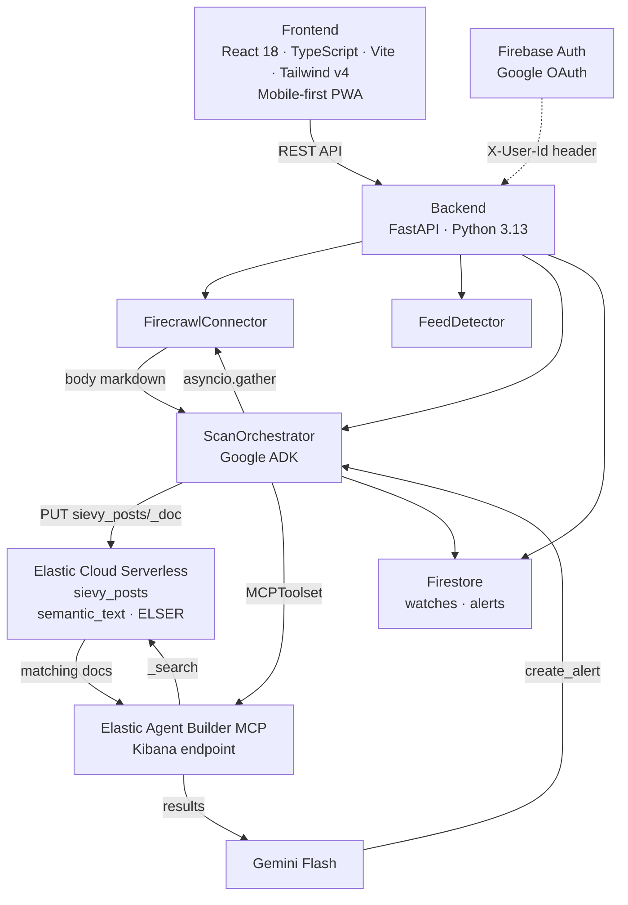
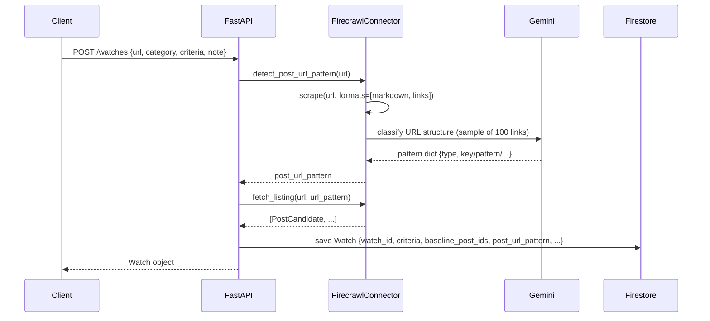
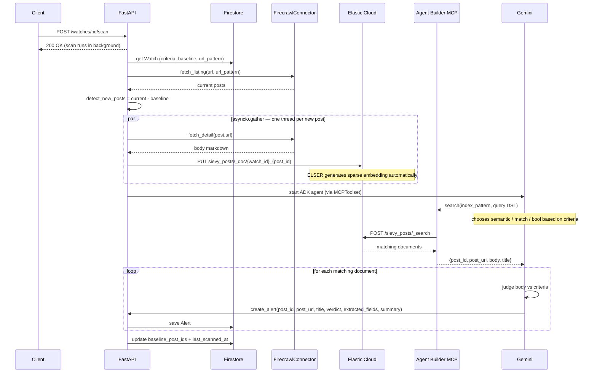
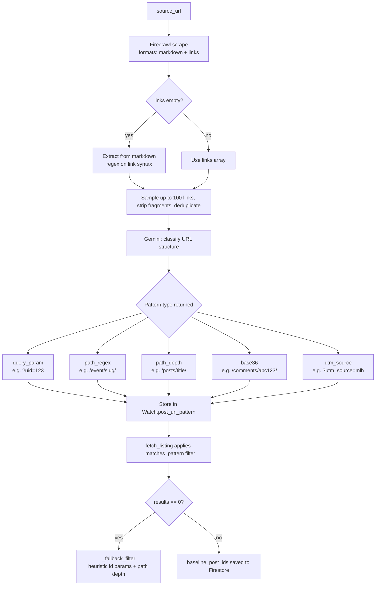

# Architecture

## Component Overview

## Data Flow: create_watch

## Data Flow: scan

## URL Pattern Detection

Runs once at `create_watch` time. The result is stored in `Watch.post_url_pattern` and reused on every scan.

**Pattern types:**

| Type          | Match logic                       | Example                               |
| ------------- | --------------------------------- | ------------------------------------- |
| `query_param` | Presence of a specific query key  | `?uid=935922`                         |
| `path_regex`  | Path matches a regex              | `/event/[^/]+/`                       |
| `path_depth`  | Path deeper than listing URL      | `/scholarships/stem-2025`             |
| `base36`      | Segment after a keyword is base36 | `/comments/abc123/`                   |
| `utm_source`  | `utm_source` param equals a value | `?utm_source=mlh&utm_campaign=events` |

## ELSER Semantic Search

The `body` field is mapped as `semantic_text` in Elasticsearch. When a document is indexed, Elastic Cloud automatically runs ELSER to generate sparse vector embeddings. No external embedding step is required.

At search time, the Gemini agent (via Elastic Agent Builder MCP) selects the most appropriate query type:

| Criteria language / content      | Query                | Reason                         |
| -------------------------------- | -------------------- | ------------------------------ |
| Korean criteria, English content | `semantic`           | ELSER bridges the language gap |
| Same language, specific values   | `match`              | Exact keyword matching         |
| Mixed                            | `bool` with `should` | Combines both                  |

The `semantic` query uses ELSER's learned semantic space. Korean input "페더럴웨이" will match English content "Federal Way" because ELSER learns cross-lingual semantic relationships.

## Firestore–Elasticsearch Sync

| Event                        | Firestore                                     | Elasticsearch                               |
| ---------------------------- | --------------------------------------------- | ------------------------------------------- |
| `create_watch`               | Save Watch doc with baseline                  | —                                           |
| `scan` (each new post)       | —                                             | PUT `sievy_posts/_doc/{watch_id}_{post_id}` |
| `scan` completed (no errors) | Update `baseline_post_ids`, `last_scanned_at` | —                                           |
| `delete watch`               | Delete Watch → cascade delete Alerts          | `delete_by_query` on `watch_id`             |

Baseline and Elasticsearch index are independent stores. If a scan fails with errors, the baseline is not updated — the same posts will be processed again on the next scan.
